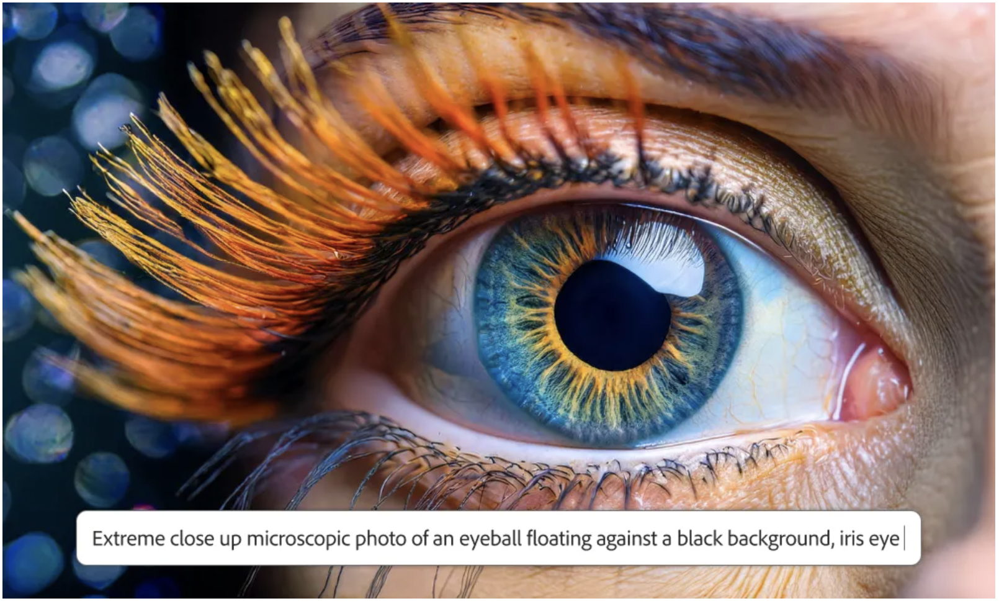
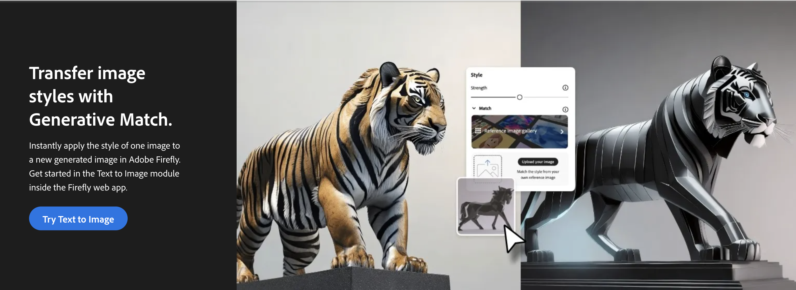
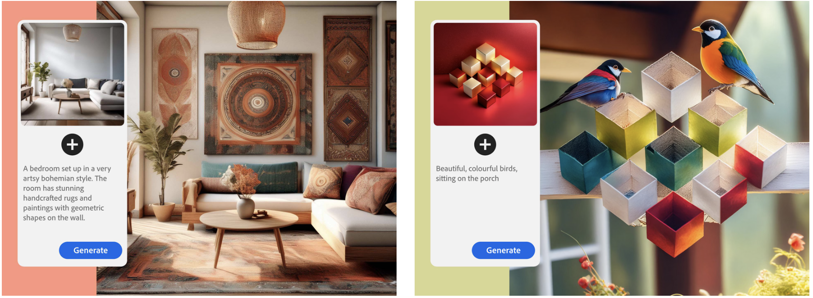
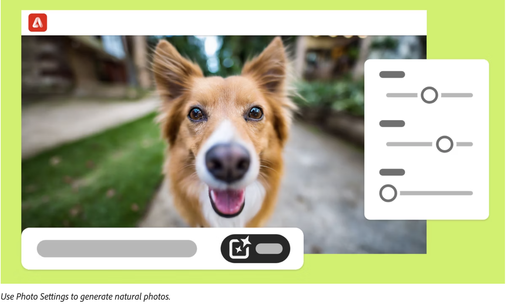
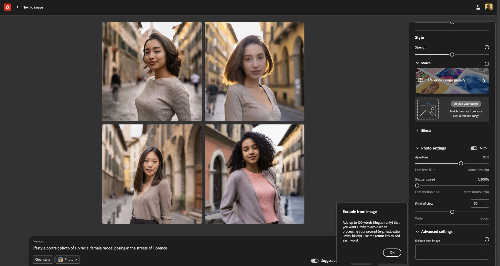
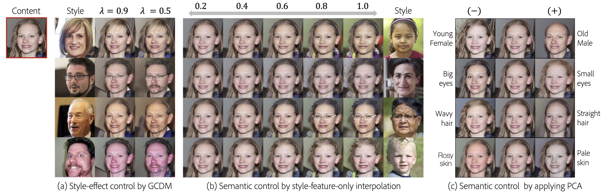
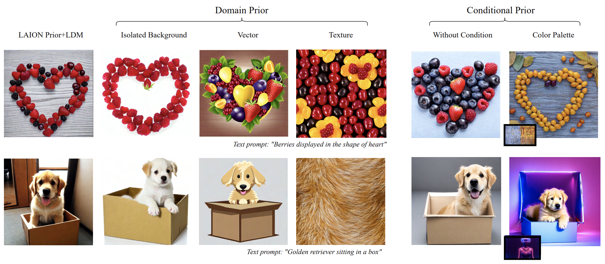
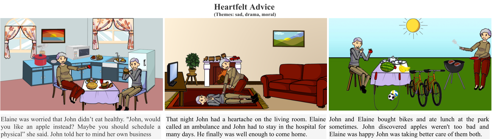
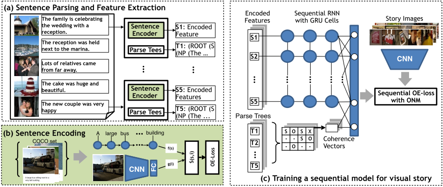

<!--   -->
<!-- I am a Senior Applied Research Scientist at Adobe's Applied Research team working on language-vision research and Generative AI. I completed my PhD from the [CS](https://www.cs.rutgers.edu/) department at the [Intelligent Visual Interfaces](https://ivi.cs.rutgers.edu/) lab in [Rutgers University](http://newbrunswick.rutgers.edu/). My PhD thesis was on Multimodal Story Comprehension, under the supervision of [Dr. Mubbasir Kapadia](https://www.cs.rutgers.edu/~mk1353/) and [Dr. Gerard De Melo](http://gerard.demelo.org/). My research interests are on joint understanding of images/videos and abstract/narrative text with applications to multimodal story comprehension. Specificaly, story illustration, visual storytelling, image captioning and text-to-image retreival/generation. Recently, I have been working on Diffusion Models for Image generation and editing.
 -->
# Internships
 

    We are always on the lookout for summer PhD research interns to work on text to image generation, interactive and multi-turn editing and Multimodal models. If you are interested, reach out to me via email or linkedin with your CV. Below is a list of current and past summer interns.  
     
     
    <strong>2024</strong>  
     
    <a href="https://maitreyapatel.com/" target="_blank">Maitreya Jitendra Patel</a> (ASU) - Disentangled Representation Learning  
     
    <a href="https://scholar.google.com/citations?user=yTQbz6AAAAAJ&hl=en&oi=sra" target="_blank">Song Wen</a> (Rutgers) - Object Centric Representation Learning  
     
    <a href="https://ml-research.github.io/people/mbrack/index.html" target="_blank">Manuel Brack</a> (TU Darmstadt) - Text to Image Generation  
     
    <a href="https://kxh001.github.io/" target="_blank">Xianghao Kong</a> (UC Riverside) - Image Generation as Scene Composition
     
     
    <strong>2023</strong>  
     
    <a href="https://wonwoongcho.github.io/" target="_blank">Wonwoong Cho</a> (Purdue) - Controllability of Diffusion Models (ECCV 2024) 
     
     
     

# Research Projects / Industry  
 

 Highlighting projects and softwares that I developed or led the development of. 

<head>

</head>
<body>
<!-- 

  

     
  

  

    

        Our latest work on Regional prompting to give precise control of object placement in scenes showcased in Adobe's MAX 2024. 
    

  
  

  -->
<!-- 
 -->

  

     
  

  

    

        Adobe's latest text to image generative model, FireFly Image Model 3 with higher quality and text to image alignment. News coverage in <a href="https://www.techradar.com/computing/adobe-firefly-s-latest-image-model-looks-like-a-generational-leap-and-i-can-t-wait-to-try-it" target="_blank">tech radar</a>, <a href="https://www.pcmag.com/reviews/adobe-firefly" target="_blank">PC Mag</a>, <a href="https://venturebeat.com/ai/adobe-launches-firefly-3-with-full-ai-image-generation-in-photoshop/" target="_blank">Venture Beat</a> and <a href="https://www.theverge.com/2024/4/23/24138011/adobe-firefly-3-ai-model-photoshop-tools-reference-image" target="_blank">The Verge</a>. I was the technical lead of this project and contributed to the core architecture, training and inference improvements. 
    

  
  

 
 

  

     
  

  

    

        State of the art zero shot <a href="https://helpx.adobe.com/in/firefly/using/style-match.html" target="_blank">stylized image generation</a> enables generating an image conditioned on text prompt and a style reference image released in FireFly Image Model 2. Selected news articles that talk about the model and its capabilities are <a href="https://www.cgchannel.com/2023/10/adobe-launches-new-image-2-ai-model-in-firefly/" target="_blank">CG Channel</a>, <a href="https://techcrunch.com/2023/10/10/adobe-firefly-can-now-generate-more-realistic-images/" target="_blank">Tech crunch</a>, <a href="https://aibusiness.com/nlp/adobe-rolls-out-firefly-2-embeds-ai-across-its-apps" target="_blank">AI Business</a>. The feature is based on my patent on zero-shot stylized image generation on Diffusion models.   
    

  
  

 
 

  

     
  

  

    

        Structure Match enables generating an image conditioned on a text prompt and a reference image to match the structure released in FireFly Image Model 2. Structure and Style match both were rated as best in class by <a href="https://www.zdnet.com/article/best-ai-image-generator/ZDNet" target="_blank">ZDNet</a>. I was the technical lead of this project. 
    

  
  

 
 

  

     
  

  

    

        Photographic and content type control on Adobe's FireFly Image Model 2 based on our research. Here is the <a href="https://helpx.adobe.com/firefly/using/whats-new/2024.html" target="_blank">release blog</a> from Adobe. Project was part of the FireFly 2 project that I co-led.
    

  
  

 
 

  

     
  

  

    

        FireFly Image Model 2, Adobe's text to image generative model that gives high quality, aesthetics and reaslism and trained only on copyrighted data. Selectd news articales that covered the model include <a href="https://www.cnet.com/tech/services-and-software/adobe-firefly-review-ai-images-for-artists-and-stock-photo-fans/" target="_blank">CNET</a>, <a href="https://techcrunch.com/2023/10/10/adobe-firefly-can-now-generate-more-realistic-images/" target="_blank">Tech crunch</a>, <a href="https://aibusiness.com/nlp/adobe-rolls-out-firefly-2-embeds-ai-across-its-apps" target="_blank">AI Business</a>. I contributed to the core architectural design choices that improved realism, text to image alignment and aesthetics and was the co technical lead of the project.      
    

  
  

 

</body>
 
 
 
# Research Publications  
 
 
<head>

</head>
<body>

  

<!--     <h2>Enhancing Controllability of Diffusion Models</h2> -->
<!--        -->
     
  

  

    

        Enhanced Controllability of Diffusion Models via Feature Disentanglement and Realism-Enhanced Sampling Methods
         
        <a href="https://wonwoongcho.github.io/" target="_blank">Wonwoong Cho</a>, 
        <strong>Hareesh Ravi</strong>,
        <a href="https://www.linkedin.com/in/midhun-harikumar-9574b524/" target="_blank">Midhun Harikumar</a>,
        <a href="https://www.linkedin.com/in/vinh-khuc-3390a52a/" target="_blank">Vinh Khuc</a>,
        <a href="https://krsingh.cs.ucdavis.edu/" target="_blank">Krishna Kumar Singh</a>,
        <a href="https://scholar.google.com/citations?user=jN2Y51YAAAAJ&hl=en&oi=ao" target="_blank">Jingwan Lu</a>,
        <a href="https://www.davidinouye.com/" target="_blank">David I. Inouye</a>,
        <a href="https://www.linkedin.com/in/kaleajinkya/" target="_blank">Ajinkya Kale</a>
         
        ECCV 2024
         
        <a href="https://www.ecva.net/papers/eccv_2024/papers_ECCV/papers/05452.pdf" target="_blank"><button class="btn pdf">pdf</button></a>
<!--         <a href="" target="_blank"><button class="btn code">code</button></a> -->
        <a href="https://arxiv.org/abs/2302.14368" target="_blank"><button class="btn bibtex">bibtex</button></a>
        <a href="https://arxiv.org/abs/2302.14368" target="_blank"><button class="btn arxiv">arxiv</button></a>
    

  
  

 

  

<!--     <h2>PREDITOR</h2> -->
<!--        -->
     
  

  

    

        PREDITOR: Text Guided Image Editing with Diffusion Prior
         
        <strong>Hareesh Ravi</strong>,
        <a href="https://www.linkedin.com/in/sachinkelkar/" target="_blank">Sachin Kelkar</a>,
        <a href="https://www.linkedin.com/in/midhun-harikumar-9574b524/" target="_blank">Midhun Harikumar</a>,
        <a href="https://www.linkedin.com/in/kaleajinkya/" target="_blank">Ajinkya Kale</a>
         
        Preprint 2023
         
        <a href="https://arxiv.org/pdf/2302.07979.pdf" target="_blank"><button class="btn pdf">pdf</button></a>
<!--         <a href="" target="_blank"><button class="btn code">code</button></a> -->
        <a href="https://arxiv.org/abs/2302.07979" target="_blank"><button class="btn bibtex">bibtex</button></a>
        <a href="https://arxiv.org/abs/2302.07979" target="_blank"><button class="btn arxiv">arxiv</button></a>
    

  
  

 

  

<!--     <h2>PREDITOR</h2> -->
<!--        -->
     
  

  

    

        Controlled and Conditional Text to Image Generation with Diffusion Prior
         
        <a href="https://scholar.google.com/citations?hl=en&user=GBzNvsMAAAAJ&view_op=list_works&sortby=pubdate" target="_blank">Pranav Aggarwal</a>,
        <strong>Hareesh Ravi</strong>,
        ...,
        <a href="https://www.linkedin.com/in/kaleajinkya/" target="_blank">Ajinkya Kale</a>
         
        Preprint 2023
         
        <a href="https://arxiv.org/pdf/2302.11710" target="_blank"><button class="btn pdf">pdf</button></a>
<!--         <a href="" target="_blank"><button class="btn code">code</button></a> -->
        <a href="https://scholar.googleusercontent.com/scholar.bib?q=info:s4gTcPPh1m0J:scholar.google.com/&output=citation&scisdr=ClH5y-M8ELD9yKXZUHk:AFWwaeYAAAAAZxXfSHkM7pOk8HHWpyIyUe15goU&scisig=AFWwaeYAAAAAZxXfSHAgpQs1w22JBap81wWorCM&scisf=4&ct=citation&cd=-1&hl=en" target="_blank"><button class="btn bibtex">bibtex</button></a>
        <a href="https://arxiv.org/abs/2302.11710" target="_blank"><button class="btn arxiv">arxiv</button></a>
    

  
  

 

  

<!--     <h2>PREDITOR</h2> -->
<!--        -->
     
  

  

    

        Cross-Modal Coherence Model for Text to Image Retrieval
         
        <strong>Hareesh Ravi</strong>,
        <a href="https://www.malihealikhani.com/" target="_blank">Malihe Alikhani</a>,
        <a href="https://klory.github.io/" target="_blank">Fangda Han</a>,
        <a href="https://ivi.cs.rutgers.edu/" target="_blank">Mubbasir Kapadia</a>
        <a href="https://www.linkedin.com/in/vladimir-pavlovic-a5528412/" target="_blank">Vladimir Pavlovic</a>
        <a href="https://people.cs.rutgers.edu/~mdstone/" target="_blank">Mathew Stone</a>
         
        AAAI 2022
         
        <a href="https://ojs.aaai.org/index.php/AAAI/article/view/21285" target="_blank"><button class="btn pdf">pdf</button></a>
        <a href="https://ojs.aaai.org/index.php/AAAI/article/view/21285" target="_blank"><button class="btn bibtex">bibtex</button></a>
        <a href="https://arxiv.org/abs/2109.11047" target="_blank"><button class="btn arxiv">arxiv</button></a>
    

  
  

 

  

<!--     <h2>AESOP</h2>
       -->
     
  

  

    

        AESOP: Abstract Encoding of Storied Objects and Pictures
         
        <strong>Hareesh Ravi</strong>,
        <a href="https://kushalkafle.com/" target="_blank">Kushal Kafle</a>,
        <a href="https://research.adobe.com/person/scott-cohen/" target="_blank">Scott Cohen</a>,
        <a href="https://www.linkedin.com/in/jonathan-brandt-23b334/" target="_blank">Jonathan Brandt</a>
        <a href="https://ivi.cs.rutgers.edu/" target="_blank">Mubbasir Kapadia</a>
         
        ICCV 2021
         
        <a href="https://openaccess.thecvf.com/content/ICCV2021/html/Ravi_AESOP_Abstract_Encoding_of_Stories_Objects_and_Pictures_ICCV_2021_paper.html" target="_blank"><button class="btn pdf">pdf</button></a>
        <a href="" target="_blank"><button class="btn code">code</button></a>
        <a href="https://openaccess.thecvf.com/content/ICCV2021/html/Ravi_AESOP_Abstract_Encoding_of_Stories_Objects_and_Pictures_ICCV_2021_paper.html" target="_blank"><button class="btn bibtex">bibtex</button></a>
        <a href="https://openaccess.thecvf.com/content/ICCV2021/papers/Ravi_AESOP_Abstract_Encoding_of_Stories_Objects_and_Pictures_ICCV_2021_paper.pdf" target="_blank"><button class="btn arxiv">arxiv</button></a>
    

  
  

 

 
  

<!--     <h2>Show Me a Story</h2> -->
     
  

  

    

         Show Me a Story: Towards Coherent Neural Story Illustration
         
        <strong>Hareesh Ravi</strong>,
        <a href="https://scholar.google.com/citations?user=B6JR50gAAAAJ&hl=en&oi=sra" target="_blank">Lezi Wang</a>,
        <a href="https://research.adobe.com/person/scott-cohen/" target="_blank">Carlos Muniz</a>,
        <a href="https://www.cs.ubc.ca/~lsigal/" target="_blank">Leonid Sigal</a>
        <a href="https://people.cs.rutgers.edu/~dnm/" target="_blank">Dimitris Metaxas</a>
        <a href="https://ivi.cs.rutgers.edu/" target="_blank">Mubbasir Kapadia</a>
         
        CVPR 2017
         
      <a href="http://http://openaccess.thecvf.com/content_cvpr_2018/papers/Ravi_Show_Me_a_CVPR_2018_paper.pdf" target="_blank"><button class="btn pdf">pdf</button></a>
      <a href="https://github.com/Hareesh-Ravi/Show-Me-A-Story" target="_blank"><button class="btn code">code</button></a>
      <a href="/bib/showMeAStory_bib.bib" target="_blank"><button class="btn bibtex">bibtex</button></a>
    

  
  

</body>
 
   
# Work Experience 
 
 
<head>

</head>
<body>

  

    
  

  

    

    <i>May, 2020 - Aug, 2020</i> 
    <b>Deep Learning Research Intern</b> 
    <i>Advisers: <a href="https://research.adobe.com/person/scott-cohen/" target="_blank">Dr. Scott Cohen</a>, <a href="https://kushalkafle.com//" target="_blank">Dr. Kushal Kafle</a>, <a href="https://research.adobe.com/person/jonathan-brandt/" target="_blank">Dr. Jonathan Brandt</a></i> 
    

   

  

    
  

  

   
    

    <i>June, 2017 - Sep, 2017</i> 
    <b>Project Associate Intern</b> 
    <i>Adviser: <a href="https://ivi.cs.rutgers.edu/" target="_blank">Dr. Mubbasir Kapadia</a></i> 
    

  

  

    
  

  

    
    

    <i>Nov, 2013 - June, 2016</i> 
    <b>Research Associate</b> 
    <i>Adviser: <a href="https://www.iiitd.ac.in/subramanyam" target="_blank">Dr. A. V. Subramanyam</a></i> 
    

  

</body>
 
 
# Teaching Experience
 
 
<head>

</head>
<body>

  

    <i>Teaching Assistant (Fall 2016)</i>
  

  

    

    Intro to Discrete Structures
    

  

  

    <i>Teaching Assistant (Spring 2017)</i>
  

  

    
    

     Principles of Programming Languages
    

  

  

    <i>Teaching Assistant (Fall 2017)</i>
  

  

    
    

     Topics in AI - Data StoryTelling
    

  

  

    <i>Teaching Assistant (Spring 2021)</i> 
  

  

    
    

    Intro to Discrete Structures
    

  

</body>
 
 
# Professional Experience
 
 
<head>

</head>
<body>

  

    <i>Program Committee</i>
  

  

    
    

     CVPR 2024
  

  

    <i>Program Committee</i>
  

  

    
    

     AAAI 2023, CVPR 2023
  

  

    <i>Program Committee</i>
  

  

    
    

     AAAI 2022, CVPR 2022, WACV 2022, ECCV 2022
  

  

    <i>Program Committee</i>
  

  

    
    

     NAACL 2021, ACL 2021
  

  

    <i>Reviewer</i> 
  

  

    
    

    EMNLP 2020
    

  

</body>